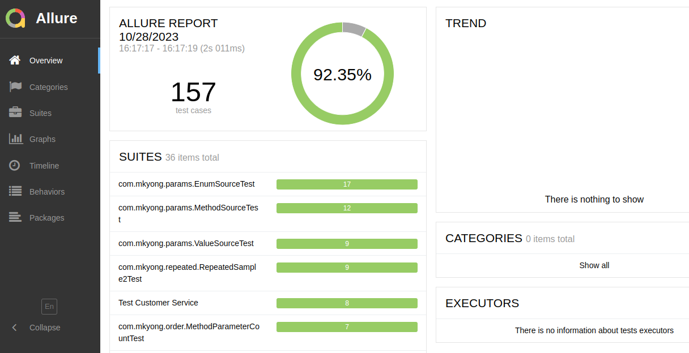

Примеры из [https://github.com/mkyong/junit5-examples](https://github.com/mkyong/junit5-examples)

САМЫЕ различные тесты с allure, params, conditional, display и чего только нет.

Проведение тестов: 

Maven:
````shell
$ mvn test
````

Gradle:
````shell
$ ./gradlew test
````

Просмотр отчетов:

````shell
junit5-examples$ allure serve allure-results/
````


Пример использования: [https://github.com/cherepakhin/companies](https://github.com/cherepakhin/companies). В этом же репозиториии(companies) применение для интеграционного тестирования.

Перед использованием в **codespace github** установить программу allure:

````shell
$ apt install allure
````

После этого выполнить:

````shell
$ ./node_modules/allure-commandline/bin/allure serve allure-results/
````
